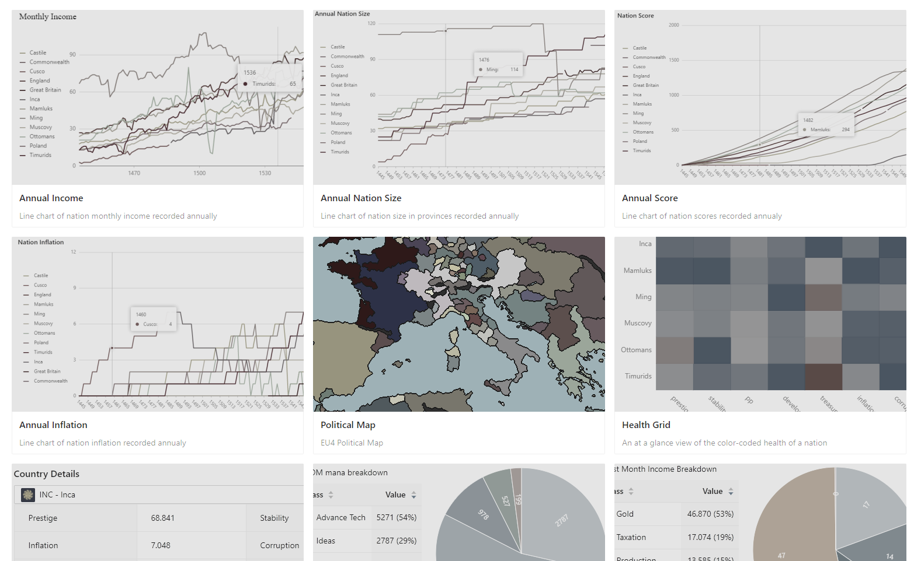
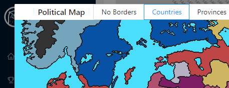

  

There's been a major update to the Rakaly UI and I wanted to walk through what's changed and the reasoning behind it. I know UI redesigns can be contentious so I'm hoping that the explanation is worth it.

<!--truncate-->

## No More Tabs

The biggest change is that there are no more tabs in the save file analyzer. Instead the analyzer now presents the user with a flat list of all the visualizations available:

*The list of visualizations available*

I talked about the reasoning a little bit in [status report 5](/blog/rakaly-status-report-5), but the crux of the issue is that the new graphs are not discoverable. With the new layout, users scrolling through the visualizations should pick up on any new ones (and if not, I'm sure adding a "New" sticker to them would be sufficient). Compare that with the old method where if I added a new graph to the ledger tab, a user would need to perform multiple clicks and know exactly where the graph is located.

It's also easier for me to develop visualizations when I don't have to worry about what tab I need to put it under, or the app needs to be structured to support it. All visualizations start to converge to the same interface this way.

The new layout also gives a sample of the visualization so that users can quickly navigate to their desired visualizations or explore around. The sample images are not previews as they are just static images. Hopefully the fact that they are static is properly conveyed by making the images faded. I'm happy to receive feedback on this fading, as I have little to no design skill (I'm worried that the fading could be mistaken as being disabled).

## The Viz Slate

Clicking on one of the visualizations brings up what I'm calling the Viz Slate, where the visualization in question will cover the entire screen for an immersive experience. There one can interact with the visualization without it getting squeezed by others.

Hopefully the lack of wasted space is apparent for map modes.

*Less space wasted for map visualizations in the rework*

One can navigate between the visualizations on the slate by hitting the arrow keys. Pressing escape will close the slate.

The downside with this layout is that data density decreases as one was previously able to view all annual ledgers at once or all the details about a country in one spot. Now one has to page through the visualizations. My goal for Rakaly has always been to allow for users to aggregate the visualizations themselves so that only the pertinent information that the user is trying to convey is displayed. In the future, I'll implement an "Add" button on the viz slate so that charts and maps appear in a blank space that the user can arrange and size as desired.

## Casualties

As part of the rework, I spent some time updating the libraries that underpin Rakaly. Unfortunately, the charting library's update no longer supports racing bar charts, so I removed them. Feels a bit foolish saying this as I just highlighted nation size racing bar chart in [status report 5](/blog/rakaly-status-report-5)

*The Nation size racing bar chart has been removed in the rework. Rip.*

They are not gone forever though. Racing bar charts are quite entertaining so if I have to implement them by hand, I will -- it'll just take a little longer.

The building count racing bar chart is also counted among the casualties.

## Minor Changes

- New UI for maps allows one to fit to screen, show only players, players + subjects, conflicting controllers, province id on hover, and paint subjects the same hue as overlord.
- A country's building count chart now has the y-max set to the number of provinces owned by said country. This will give a better indication of how tall a country is playing.
- "Advisors" in the expense breakdown has been renamed to "Hiring Advisors" as it could be easy to get confused between "Advisors" and "Advisors Maintenance"
- Not part of the UI rework, but [Rakaly has a CLI](https://github.com/rakaly/cli) that will melt your saves.
- Renamed Health Map to Health Grid as it is not really a map (it was originally named after heat maps).

## Feedback Welcomed

I don't know if this rework makes sense or is a net benefit, so feel free to make your voice heard in the discord.